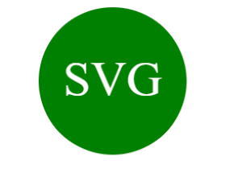

# Module 10 Challenge SVG Maker

 

 ## Description 
 This program will allow you to generate SVG logos base on your choice of shapes (triangle, circle or square). You will also be given the option to color your shape and text by color keyword or hexadecimal numbers. Input your text choice of up to 3 characters and no less than 1 character.

 Watch a video demonstration:
[SVG Logo Demo](https://drive.google.com/file/d/16kHebWX-qffmJSLe7_5h_8maaH-eEqLz/view)

 ## Table of Contents
* [Installation](#installation)
* [Usage](#usage)
* [License](#license)
* [Contributing](#contributing)
* [Tests](#tests)
* [Contact](#contact)

# Installation 

Make sure that you have Node.js install, if you do not have node.js, you can visit [Node.js website](https://nodejs.org/en) and downlown node and install it onto your local computer. 

To install node.js onto your computer go to your terimal and type in "npm install" this line of code will install node onto your computer. 

In the terimal you will also want to download "jest" by typing in "npm i jest - D" this will install Jest as a devDependency where we can do our testing.

To run the application, within the terminal, type in the command "node index.js"

## License 

[MIT License](https://opensource.org/licenses/MIT)

## Contributing

Created for module 10 challege of the U of M full stack boot camp. Contact me with ideas and request for changes.

## Tests
 Each shape is tested for a render, shape color, text, and text color. Type in "npm test" in the cammand line, and jest will run the test.

 ## Contact

 * Email: xiongxeng@gmail.com
 * Github: http://github.com/freeway9527
